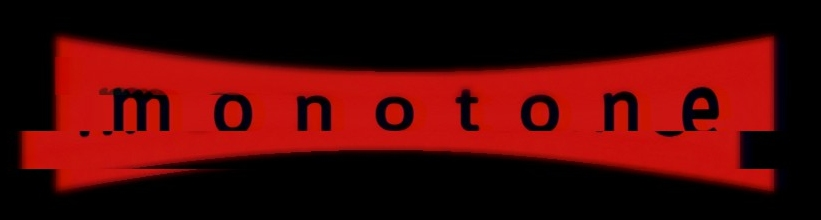

<div align="center">
<h1>Monotone WordPress Theme</h1>
  
</div>

Monotone is a flexible, modular WordPress theme that leverages the power of Advanced Custom Fields (ACF) for layout configuration. It uses a modern Vite build system and provides a variety of
theme color options, including a high-contrast mode for accessibility. All fonts are served directly from the theme directory, ensuring a consistent and fast user experience.

## Features

- **ACF Flexible Content Fields**: Monotone uses ACF to provide a block-based layout system. Each block comes with its own configuration settings, allowing for a high degree of customization. All
  field settings are backed up by a JSON file, making it easy to import and export configurations.

- **Vite Build System**: Monotone uses Vite as its build system, providing fast and efficient compilation of assets. It supports both editor and admin style options, compiled from SCSS.

- **Theme Color Options**: Monotone offers several theme color options, including a high-contrast mode for better accessibility.

- **Fonts Served from Theme Directory**: To ensure a consistent user experience and faster load times, all fonts are served directly from the theme directory.

- **Custom Branding Options**: Monotone provides custom branding options in the Customizer, allowing you to easily customize the site's logo, colors, and more.

- **Responsive Image Markup**: Monotone handles the image sizes, conversion to WEBP, and responsive image markup.

- **Custom Shortcodes**: Monotone includes custom shortcodes in the MCE editor for easy content creation.

## Classes

The theme's functionality is organized into classes, each residing in the `classes` directory. Here are the main classes:

- `ACF Editor Palette`: Adds custom colors to the theme options to control the palette of the Flexible Content Fields.
- `ACF`: Handles the registration of ACF fields and blocks, as well as the import and export of field settings.
- `Assets`: Handles the enqueueing of scripts and styles, and the dequeueing of WP Block Library CSS.
- `Admin Template Filter`: Filter pages by template in the admin page list.
- `Autoactivate`: Automatically activates the theme's default plugins.
- `Blog`: Handles the blog functionality and rewrite rules.
- `Branding`: Adds custom branding options to the Customizer.
- `Constants`: Defines the theme's constants.
- `Gravity Forms`: Adds custom styles to Gravity Forms.
- `Images`: Handles the image sizes, conversion to WEBP, and responsive image markup.
- `Layout`: Handles the layout configuration and the rendering of Flexible Content Layout blocks.
- `Navigation`: Handles the navigation menus.
- `Replace LSEP`: Replaces the line separator character with a space.
- `Shortcodes`: Adds custom shortcodes to the MCE editor.
- `SVG Icons`: Adds a library of SVG icons to the theme.
- `Theme:`: Handles the theme's setup and configuration.
- `TinyMCE`: Adds custom styles to the TinyMCE editor.
- `Widgets`: Registers the theme's widgets and sidebars.

## Build Setup

The theme uses npm for package management. To get started, navigate to the `assets` directory and install the dependencies:

```bash
npm install
```

To build the project, use the following command:

```bash
npm run build
```

## Contributing

Contributions are welcome!

## License

Monotone is licensed under the GNU General Public License v2 or later.


