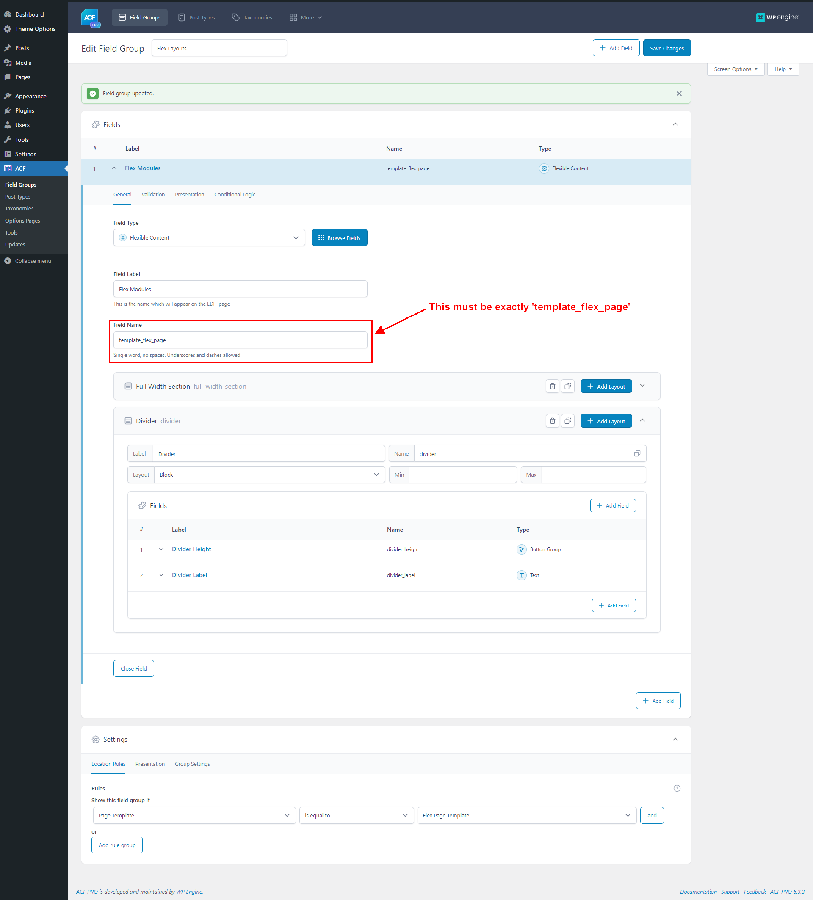

# ACF Flexible Content Layout Modules

This theme provides a special "Flex Page Template" that allows theme developers to create custom page layouts using Advanced Custom Fields (ACF) Flexible Content fields. This feature requires ACF Pro, and you must assign the "Flex Page Template" to a page in the WordPress admin.

This guide will walk you through the process of adding new layout modules to the theme. 

## Structure
The Flex Page Template loader is located in the `template-flex-page.php` file in the theme root. The layout modules are located in the `layouts` directory. The `layouts.js` file in the `layouts` directory is used to import all layout modules into the theme build process via `assets/src/layout.js`.
```
template-flex-page.php
layouts/
   |--layouts.js
   |--my_layout/
      |--my_layout.php
      |--my_layout.js
      |--my_layout.scss (optional)
assets/
   |--src/
      |--index.js (you shouldn't have to touch this file)
```
Each layout consists of 

- A PHP file to define the markup
- A JavaScript file for layout-specific functionality and optionally importing custom styles
- An optional SCSS file for custom styles, if needed.
  - Bootstrap is available in this theme, so you can instead use its utility classes directly in your markup.

## Step 1: Create Your Layout Module Markup

1. **Create a New Directory**: Inside the `layouts` directory, create a new directory named after your layout. Use snake_case names (e.g., `my_layout`).

2. **Add PHP File**: Inside your new directory, create a PHP file with the same name as your directory (e.g., `my_layout.php`). This file will be used to define the markup for your layout.

```scss
   // my_layout.php
   
   <?php 
   
   $divider_height = get_sub_field('divider_height');
   $divider_label = get_sub_field('divider_label');
   
   $id      = $args['id'] ?? '';
   $classes = $args['classes'] ?? '';
   $styles  = $args['styles'] ?? '';
   ?>
   
   <div id="<?= $id ?>" class="<?= $classes ?>" style="<?= $styles ?>">
   
       <div class="container">
   
           <div class="<?=$divider_height?> user-select-none position-relative d-flex justify-content-end mt-4 pt-2 border-top border-1 border-primary-light">
               <?php if ($divider_label) { ?>
                   <span class="text-uppercase text-primary-light w-90 text-end small"><?= $divider_label ?></span>
               <?php } ?>
           </div>
   
       </div>
   
   </div>
```

1. **Add JavaScript File**: Inside your new directory, create a JavaScript file with the same name as your directory (e.g., `my_layout.js`). This file will be used to import your SCSS file and include any JavaScript specific to your layout.
```javascript
   // my_layout.js

   // Import SCSS
   import './my_layout.scss';

    // Just an example
   document.addEventListener('DOMContentLoaded', function () {
      const dividers = document.querySelectorAll('.divider')
      dividers.forEach(divider => {
         const dividerHeight = divider.getAttribute('data-divider-height')
         divider.style.height = `${ dividerHeight }px`
      })
   })
   ```

4. **Add SCSS File (Optional)**: If your layout requires custom styles, create an SCSS file with the same name as your directory (e.g., `my_layout.scss`). Define your styles within this file.
   - Note: the CSS selector generated by the theme will be kebab-case (e.g., `.my-layout`). 
```scss
  // my_layout.scss

  .divider {
      background-color: #f8f9fa;
  }
```

## Step 2: Register Your Layout Module with the Theme

In the `layouts.js` file located in the `layouts` directory, import your new layout's JavaScript file.

Example:
```javascript
/**
* Import all layout modules into this file. These
* will be picked up by the Vite build process and
* added to the final build.
*
* You can add custom SCSS to each layout by creating a
* SCSS file with the same name as the layout in the same
* directory and importing it in the layout's JS file, e.g. 
* import './my_layout.scss';
*
* Note: Layout CSS selectors are dash-separated, e.g.
* .full-width-section
*/
import './my_layout/my_layout.js';
```

## Step 3: Create Your Layout Module in ACF
1. **Install and Activate ACF Pro**: This theme requires ACF Pro to use the Flexible Content field. Install and activate ACF Pro in the WordPress admin.

   - There is an example Flex Page field group in the `acf-json` directory. You can import this field group into your WordPress site to see how the Flex Page Template is set up. Read on if you want to do it manually.

1. **Create a New Flexible Content Field**: In the WordPress admin, navigate to `ACF > Field Groups` and create a new field group. 

1. **Add a new Flexible Content field** and name it appropriately (e.g., `Flex Layouts`).

   - <span style="color:red">**Important!**</span> Set the Field Name to `template_flex_page`. This name is used by the Flex Page Template loader to register the fields. See the image below for reference.

1. **Assign the Field Group to the Flex Page Template**: In `Settings > Location Rules`, set `Show this field group if` to `Page Template` `is equal to` `Flex Page Template`.

1. **Add Your Layout Modules**: Add a new layout module to the Flexible Content field and name it appropriately (e.g., `My Layout`). Select the layout module.

1. **Configure the Layout Module Fields**: Add any necessary fields to the layout module to allow content editors to customize the layout. Configure the fields as needed.

1. **Save the Field Group**: Save the field group to apply the changes.

1. **Assign the Flex Page Template to a Page**: In the WordPress admin, create a new page or edit an existing page. Assign the `Flex Page Template` to the page.


